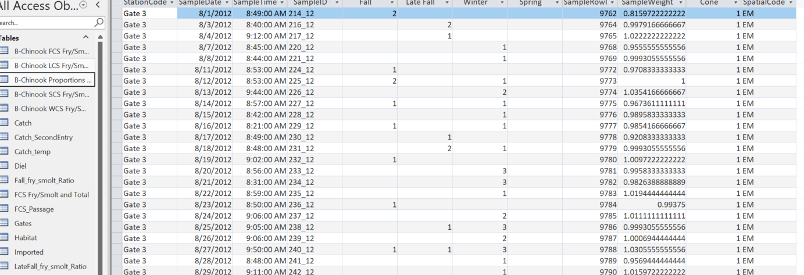

Objective: This markdown is focused on designating run assignment using Length-at-date (LAD) for juveniles passing Red Bluff Diversion Dam (RBDD) via R script. Both CBR and USFWS have shared Length-at-date run designation tables. USFWS currently assigns run designation using a macro in Access but would like to automate via R. To confirm run designation methods, this markdown uses the CBR and USFWS LAD tables to assign run designation to catch data from the EDI Data portal and then compare to the `run` column within catch.csv.

Data sources:

-   CBR shared file of Dept. of Water Resources LAD run designation: lengthcriteriariver.csv renamed run_designation_cbr.csv
-   USFWS shared file: RunDesignation.csv renamed run_designation_fws.csv
-   EDI Data portal - RBDD : <https://portal.edirepository.org/nis/mapbrowse?scope=edi&identifier=1365&revision=1>
-   SacPas LAD figures: <https://www.cbr.washington.edu/sacramento/data/delta_salvage.html>

Run designation naming:

-   lengthcriteriariver.csv: "WL" "WE" "LFL" "LFE" "FL" "FE" "SL" "SE" "WL.1" "WE.1" "LFL.1" "LFE.1" "FL.1" "FE.1" "SL.1" "SE.1"

-   RunDesignation.csv: "F", "L", "W", "S"

-   catch.csv: "fall run", "late fall run", "spring run", "winter run", "not reported"

-   renamed runs to: "fall", "late_fall", "spring", "winter"; also included "no length", "no date", "no length or date", "no run designated"

To do:

-   current function assigns run base on presence/absence of date and length. Catch.csv data has run designation for catch_id's with length data but no date. Find methods (likely in macros, possibly genetic or date based) to determine how this is designated.

-   Double check method is matching run assignment in catch.csv (allow for genetic corrections) -- share results in easily digestable format

-   Compare CBR method to USFWS method -- issue with first pass at converting CBR file causing differences in run assignments. Adjusted to include NA's in min/max thresholds and fit is much better. Still 3 mm/dd of different threshold splits that need confirmation - Use Johnson et al 1992 (favor later run) or stick with FWS completely.  

Bill Poytress information via email exchange:

```         
  "Thanks Jen for the update.  And yes LAD assignment is a macro we run within Access, so hard coding it in R would be a lot better for the process.  The one thing to keep in mind, is that we do after the fact genetic corrections in some cases for spring and winter run in the fall period each year.  I wonder if we should actually assign race and then export the csv's to EDI?  Let me know your thoughts on that situation.  Thanks for the update and progress!!"

  "Upon further investigation I found two things regarding run assignment.  A) the rbdd.catch.csv files we have uploaded to EDI include a run designation for all measured fish in the column "run".  B) Fish are designated a runID of "n/p" for all other species and for chinook plus counts that need run assignment through the "Wild_Totals"  macro currently in access that takes the plus count from any given trap and applies the ratio of spring, winter, fall or late-fall fish from the measured fish within a specific sample and applies that value to the plus count fish and then sums them by run.  C) Not sure how the LengthCriteriaRiver.csv file from DWR handles the overlap of foklengths from the original Frank Fisher/Sheila Greene table, but it could be handled differently than the table we use (stored in access) as RunDesignation.  Technically, we followed Johnson et al. 1992 which indicates the value of the forklength overlap should correspond to the later spawning group.    See the table in the access file to confirm, or see the attached, exported copy of the table we use for runID."

```


Flow of events:

1. Fish pass RBDD- a portion are measured for length and date, others are assigned a date but no length. All fish are assigned a either a n/p

```{r load_libraries, warning=FALSE, message=FALSE}
library(tidyverse)
library(here)
```

```{r load_data}
## load LAD designations from CBR and USFWS
lad_cbr <- read.csv(here::here("JPI_convert_to_Rcode/data","run_designation_cbr.csv"))
lad_usfws_raw <- read.csv(here::here("JPI_convert_to_Rcode/data","run_designation_fws.csv"))
lad_fws <- lad_usfws_raw %>% select(2:7)

## load catch.csv from EDI Data portal
# Define the URL by selecting link from EDI Data portal -- catch.csv
url <- "https://portal.edirepository.org/nis/dataviewer?packageid=edi.1365.1&entityid=58540ac4ed34ce05f3309510f4be91e5"

# Download and read the CSV file into a data frame
df_catch_raw <- read.csv(url)
```

```{r wrangle_data}
#wrangle fws to match cbr format
lad_fws<-lad_fws %>% 
 tidyr::separate(LookupDate, into = c("mm", "dd"), sep = "/") %>% 
  mutate(mm = as.numeric(mm),
         dd = as.numeric(dd)) %>% 
 mutate(RunDesignation = recode( RunDesignation, 
         "L" =  "late_fall",
         "F" = 'fall',
         "W" = "winter",
         "S" = "spring"))

#wrangle cbr to match fws format
lad_cbr_long <- lad_cbr %>% 
  mutate(across(c("WL", "WE"), as.character)) %>% 
  pivot_longer(
    cols = -c(MONTH, DAY),
    names_to = c("RunDesignation", "min_max", "suffix"),
    names_pattern = "(.*)(L|E)(\\.1)?",
    names_repair = "minimal"
  ) %>% 
  mutate(value = as.integer(value)) %>% 
  pivot_wider(names_from = c(min_max, suffix), 
              values_from = value) %>% 
  rename(MinLength1 = L_, 
         MaxLength1 = E_, 
         MinLength2 = L_.1, 
         MaxLength2 = E_.1, 
         mm = MONTH, 
         dd = DAY) %>% 
   # replace_na(list(MinLength1 = 0, MaxLength1 = 0, MinLength2 = 0, MaxLength2 = 0)) %>% Removed substitution of 0's for NA's. Keep NA's
   mutate(RunDesignation = recode( RunDesignation, 
         "LF" =  "late_fall",
         "F" = 'fall',
         "W" = "winter",
         "S" = "spring"))


#filter catch.csv to chinook salmon
df_catch <- df_catch_raw %>% 
  filter(common_name == "Chinook Salmon") %>%
  mutate(start_date = lubridate::ymd(start_date)) %>% 
  select(catch_id,common_name, start_date, fork_length, count, run) %>% 
   mutate(run = recode( run, 
         "late fall run" =  "late_fall",
         "fall run" = 'fall',
         "winter run" = "winter",
         "spring run" = "spring",
         "not reported" = "not reported"))

#remove unneeded data  
rm(df_catch_raw)
rm(lad_cbr)
rm(lad_usfws_raw)
```

Compare lad tables Note: min/max1 seems to be switched for minmax2 for some of cbr matrix. Code at the bottom of this chunk rearranges to match lad_fws organization. Based on this change, only 98 rows of mm/dd/run differ between the two tables. - with introduction of NA's no longer an issue

```{r compare_LAD_designation_tables}

lad_fws <- lad_fws %>%
  mutate(mm = as.integer(mm),
         dd = as.integer(dd),
         dataset = "fws")

lad_cbr_long <- lad_cbr_long %>%
   mutate(dataset = "cbr")

# # Compare the data frames
# diff_rows <- lad_cbr_long %>%
#   mutate(dataset = "cbr") %>% 
#   anti_join(lad_fws, by = c("mm", "dd", "RunDesignation", "MinLength1", "MaxLength1", "MinLength2", "MaxLength2"))
# 

# Combine the data frames
combined_df <- bind_rows(lad_fws, lad_cbr_long)

# Find the rows that differ
diff_rows <- combined_df %>%
  group_by(mm, dd, RunDesignation, MinLength1, MaxLength1, MinLength2, MaxLength2) %>%
  filter(n() == 1)

# Find the rows that are the same
same_rows <- combined_df %>%
  group_by(mm, dd, RunDesignation, MinLength1, MaxLength1, MinLength2, MaxLength2) %>%
  filter(n() > 1)

#seems that the maxmin are just mirrored in a lot of diff_rows---re-sort to match min/max 1 and 2
#rename columns to re-sort
diff_rows_recode <- diff_rows %>% 
  filter(dataset == "cbr") %>% 
  rename(MinLength1 = "MinLength2",
         MaxLength1 = "MaxLength2",
         MinLength2 = "MinLength1",
         MaxLength2 = "MaxLength1")
#join cbr re-sorted back to fws 
diff_reorg<-diff_rows %>% 
  filter(dataset == "fws") %>% 
  bind_rows(diff_rows_recode)

#pull remaining rows that don't match -- much better 
diff_rows_reorg <- diff_reorg %>%
  group_by(mm, dd, RunDesignation, MinLength1, MaxLength1, MinLength2, MaxLength2) %>%
  filter(n() == 1)


## add reorg back to main cbr designation table to use/redo catch run designation to compare
# Remove rows from lad_cbr_long that are in diff_rows_recode
updated_lad_cbr_long <- lad_cbr_long %>%
  anti_join(diff_rows_recode, by = c("mm", "dd", "RunDesignation"))

# Add the rows from diff_rows_recode
lad_cbr_updated<- bind_rows(updated_lad_cbr_long, diff_rows_recode)

###check by joining with fws again

# Combine the data frames
combined_df <- bind_rows(lad_fws, lad_cbr_updated)

# Find the rows that only appear in one data frame -- matched 98 that do not match from code above
diff_rows <- combined_df %>%
  group_by(mm, dd, RunDesignation, MinLength1, MaxLength1, MinLength2, MaxLength2) %>%
  filter(n() == 1)

diff_rows_plot <-diff_rows %>% 
  pivot_longer(cols = c(4:7),
               names_to = "threshold",
               values_to = "length") %>% 
    mutate(date = make_date(year = 2012, month = mm, day = dd),  # set a year
         doy= yday(date))    # Extract the day of the year
  # filter(threshold %in% c("MinLength1")) # "MinLength2" 
  

ggplot(diff_rows_plot, aes(x=doy, y = length )) +
    geom_point( aes(color = dataset, shape = dataset)) +
  scale_shape_manual(values = c(0,16)) 
  

```

Function to assign run designation based on lad table

```{r fct_LAD_designation}
# Function to assign run designation based on LAD data
#lad_data should be formatted with mm dd as numeric columns
#catch_data should have start_date as a date column and fork_length as a numeric column

fct_LAD_designation <- function(lad_data, catch_data){
  
 # Extract the month and day from the start_date column in catch.csv
  catch_data <- catch_data %>%
    mutate(start_date = lubridate::ymd(start_date),
           mm = lubridate::month(start_date),
           dd = lubridate::day(start_date))
 
   # Filter lad_data based on the month, day, and fork_length in catch.csv
  catch_data %>%
    rowwise() %>% 
    mutate(run_designation =  {
      if (is.na(start_date) & is.na(fork_length)) {
        "No length or date"
      } else if (is.na(start_date) & !is.na(fork_length)) {
        "No date"
      } else if (!is.na(start_date) & is.na(fork_length)) {
        "No length"
      } else {
        matches <- lad_data$RunDesignation[
          lad_data$mm == mm & lad_data$dd == dd & 
          ((fork_length >= lad_data$MinLength1 & fork_length <= lad_data$MaxLength1) | 
           (fork_length >= lad_data$MinLength2 & fork_length <= lad_data$MaxLength2))
        ]
        if (length(matches) == 0) {
          "no run designated"
        } else {
          paste(matches, collapse = ", ") #exclude when certain all matches return one run
        }
      }
    })
}


#check designations
df_catch_designation_fws <- fct_LAD_designation(lad_data = lad_fws, catch_data = df_catch)
df_catch_designation_cbr <- fct_LAD_designation(lad_data = lad_cbr_updated, catch_data = df_catch)

#using NA's-- extact run
df_catch_designation_cbr_na <- fct_LAD_designation(lad_data = lad_cbr_long, catch_data = df_catch)

df_catch_designation_cbr_na <- df_catch_designation_cbr_na %>%
  mutate(run_designation_na = str_extract(run_designation, "\\b(?!NA\\b)[^,]+"))

#save data
 # save(df_catch_designation_fws, file =here::here("JPI_convert_to_Rcode/data","catch_run_designation_fws.rda"), compress = "xz")
  
# save(df_catch_designation_cbr, file =here::here("JPI_convert_to_Rcode/data","catch_run_designation_cbr.rda"), compress = "xz")

```

Compare lad_fws to catch.csv 
```{r compare_lad_fws_catch_data}
mismatch<-df_catch_designation_fws %>% 
  filter(run != run_designation)

# 1 with no length, date = 2016-09-25, run = winter, run_designation = no length
#24 with no date, has a length, run = (1-fall, 4-late_fall, 19-spring, 0-winter), run_designation = no date
#the rest match regarding run = not reported, run_designation = ( no length or date, no run designated)

mismatch_rm_noreport<- mismatch %>% 
  filter(!run_designation %in% c("No length", "No date", "No length or date","no run designated" )) 
# 2,089 run = fall, run_designation = spring; 3 run_designation = winter, date = 2007-03-20;
#939 run = late_fall, run_designation = fall
#500 run = spring, run_designation = winter
#>300 run = winter. run_designation = something else


```


Comparing data it seems the designation in April for late-fall is the main discrepancy between fws and cbr: catch and fws designate late_fall and cbr returns no run designation. Look into April min/max. Outside of those, a few discrepancies with 2/4 fall x spring(cbr) (8), 2/16/14 winter x spring (cbr) (1), 2/11 spring x winter,spring(cbr) (4)

```{r compare_LAD_designation_catch_data}
# Join the data frames
df_join <- df_catch_designation_fws %>%
  select(start_date, mm, dd, fork_length, run, run_designation_fws = run_designation) %>%
 cbind(run_designation_cbr = df_catch_designation_cbr_na$run_designation_na) %>% 
    mutate(year = year(start_date),
         doy = yday(start_date)) 

#for plot
df_join_long <- df_join %>% 
  pivot_longer(cols = c(5:7),
               names_to = "dataset",
               values_to = "run")

# Filter the rows where run, run_designation_fws and run_designation_cbr are not the same
df_different_runs <- df_join %>%
  filter(run != run_designation_fws | run != run_designation_cbr | run_designation_fws != run_designation_cbr) %>% 
  filter(!is.na(fork_length))

# Filter the rows where run_designation_fws and run_designation_cbr are not the same
df_different_runs_cbr.fws <- df_join %>%
  filter( run_designation_fws != run_designation_cbr) %>% 
    filter(!is.na(fork_length))
```

Differing thresholds (with updated NA's in DWR/CBR method):
2/4- CBR: 0-50, 51-69 , fws: 0-51, 52-69
2/11- CBR: 54-72, 72-145; fws:54-72, 73-145
2/16: CBR: 56-75, 76-150  fws: 56-74, 75-150

```{r plot_designations, fig.width=12}

lad <- bind_rows(
  lad_fws %>% mutate(dataset = "fws"),
  lad_cbr_updated %>% mutate(dataset = "cbr")
)

lad_plot<-combined_df %>% 
  pivot_longer(cols = c(4:7),
               names_to = "threshold",
               values_to = "length") %>% 
    mutate(date = make_date(year = 2012, month = mm, day = dd),  # set a year
         doy= yday(date))  #%>%   # Extract the day of the year
  filter(threshold %in% c("MaxLength1")) # "MinLength2" 

#cbr and fws - min1
ggplot(lad_plot, aes(x = doy, y= length) ) +
  geom_point( aes(color = RunDesignation, shape = dataset)) +
  scale_shape_manual(values = c(0,16)) +
  labs(title = "Includes all min/max length thresholds")

lad_plot %>% 
  mutate(threshold = factor(threshold, levels = c("MinLength1", "MaxLength1", "MinLength2", "MaxLength2"))) %>% 
ggplot( aes(x = doy, y= length) ) +
  geom_point( aes(color = dataset, shape = dataset)) +
  scale_shape_manual(values = c(0,16)) +
  facet_wrap(~threshold) +
    labs(title = "Facetted by individual thresholds per method of LAD designation")

# cbr and fws different 
diff_rows %>% 
    pivot_longer(cols = c(4:7),
               names_to = "threshold",
               values_to = "length") %>% 
      mutate(date = make_date(year = 2012, month = mm, day = dd),  # set a year
         doy= yday(date)) %>%   # Extract the day of the year
ggplot(aes(x = doy, y= length) ) +
  geom_point( aes(color = RunDesignation))+
  facet_grid(~dataset)


diff_rows %>%
  pivot_longer(cols = c(4:7),
               names_to = "threshold",
               values_to = "length") %>%
  mutate(date = make_date(year = 2012, month = mm, day = dd),  # set a year
         doy = yday(date),  # Extract the day of the year
         mm_dd = paste(mm, dd, sep = "/")) %>%   # Create mm/dd variable
  ggplot(aes(x = doy, y = length)) +
  geom_text(aes(label = mm_dd, color = RunDesignation)) +
  facet_grid(~dataset)

```

Remaining questions:

- How is access assigning run designation -- named race designation in some tables?

- RunDesignation table in database_dev is linked to database_be. How is this table being used in the database? 

- Macro `Wild_Totals` is only in database_dev and seems to be based off of Wild Plus Count Proportioned and then generates B-Chinook Proportions by trap table. B-Chinook Proportions by trap is also linked to database_be. But no idea how it's used in the relationship diagram. Likely through recapture length to sample to catch data?


Relational diagram:



